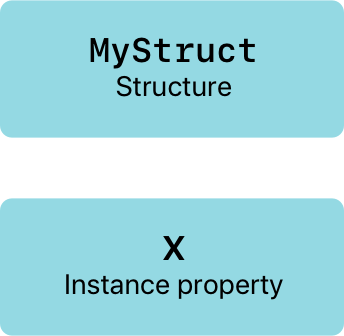

# SymbolKit

The specification and reference model for the *Symbol Graph* File Format.

A *Symbol Graph* models a *module*, also known in various programming languages as a "framework", "library", or "package", as a [directed graph](https://en.wikipedia.org/wiki/Directed_graph). In this graph, the nodes are declarations, and the edges connecting nodes are relationships between declarations.

To illustrate the shape of a symbol graph, take the following Swift code as a module called `MyModule`:

```swift
public struct MyStruct {
  public var x: Int
}
```

There are two nodes in this module's graph: the structure `MyStruct` and its property, `x`:



`x` is related to `MyStruct`: it is a *member* of `MyStruct`. SymbolKit represents *relationships* as directed edges in the graph:


The *source* of an edge points to its *target*. You can read this edge as *`x` is a member of `MyStruct`*. Every edge is qualified by some kind of relationship; in this case, the kind is membership. There can be many kinds of relationships, even multiple relationships between the same two nodes. Here's another example, adding a Swift protocol to the mix:

```swift
public protocol P {}

public struct MyStruct: P {
  public var x: Int
}
```

Now we've added a new node for the protocol `P`, and a new conformance relationship between `MyStruct` and `P`:


By modeling different kinds of relationships, SymbolKit can provide rich data to power documentation, answering interesting questions, such as:

- *Which types conform to this protocol?*
- *What is the class hierarchy rooted at this class?*
- *Which protocol provides a requirement called `count`?*
- *Which types customize this protocol requirement?*

In addition, graph representations of data also present opportunities for visualizations in documentation, illustrating the structure or hierarchy of a module.

<!-- Copyright (c) 2021 Apple Inc and the Swift Project authors. All Rights Reserved. -->
